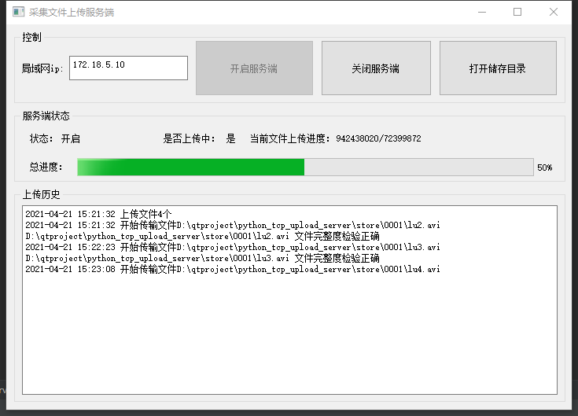

# python_tcp_upload_server
基于pyside框架实现的局域网tcp批量文件传输服务端

## Feature
- 基于PySide2的可视化界面
- 带文件完整性检验

## 客户端项目地址
https://github.com/a2824256/Python-Tcp-Upload-Client

## Pyinstaller打包相关问题汇总
https://blog.csdn.net/a2824256/article/details/114699656

## Demo

