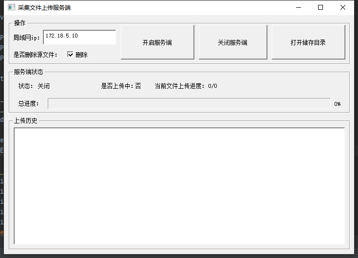

# python_tcp_upload_server
基于pyside框架实现的局域网tcp批量文件传输服务端

## Feature
- 基于PySide2的可视化界面
- 带文件完整性检验及提醒
- 备份完是否删除源文件选择 

## windows平台可执行文件下载
[V1.0版本 - 点我下载](https://github.com/a2824256/Python-Tcp-Upload-Server/releases/tag/v1.0)

## 客户端项目地址
https://github.com/a2824256/Python-Tcp-Upload-Client

## Pyinstaller打包相关问题汇总
https://blog.csdn.net/a2824256/article/details/114699656

## Demo

